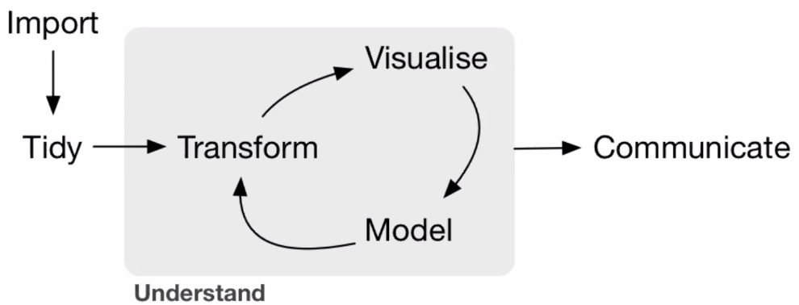

--- 
title: "Proyecto RNA-seq"
author: "Paulina Rosales-Becerra"
date: "`r Sys.Date()`"
site: bookdown::bookdown_site
favicon: "dna_favicon.png"
---

# Generalidades {-}

Este proyecto busca retomar las herramientas y conocimientos recuperados en el [curso de RNA-seq 2021](https://github.com/lcolladotor/rnaseq_LCG-UNAM_2021) impartido por [Leonardo Collado-Torres](http://lcolladotor.github.io/) para los estudiantes de la [Licenciatura en Ciencias Genómicas](https://lcg.unam.mx/) de la UNAM.

**Ligas externas**

- [Información Paulina Rosales-Becerra](https://paurosales.github.io/)

- [GitHub Paulina Rosales-Becerra](https://github.com/paurosales)

- [Repositorio del curso](https://github.com/lcolladotor/rnaseq_LCG-UNAM_2021)

- [Notas del curso](https://github.com/paurosales/curso_rnaseq_2021)

- [Repositorio del proyecto *(source code)*](https://github.com/paurosales/proyecto_rnaseq_2021)

## Proyecto: Datos de SRP11148 {-}

El proyecto que elegí fue: [*"Transcriptomic and genomic profiling of early-stage ovarian carcinomas associated with histotype and overall survival [RNA-seq]"*](https://www.ncbi.nlm.nih.gov/pmc/articles/PMC6205557/) (ID: SRP11148), la elección fue basada únicamente en interés por el tema y número de muestras (n=96).

### *Abstract* {-}

*"Ovarian cancer is the most lethal gynecological malignancy in the western world. Despite recent efforts to characterize ovarian cancer using molecular profiling, few targeted treatment options are currently available. Here, we examined genetic variants, fusion transcripts, SNP genotyping, and gene expression patterns for early-stage (I, II) ovarian carcinomas (n=96) in relation to clinicopathological characteristics and clinical outcome, thereby identifying novel genetic features of ovarian carcinomas. Furthermore, mutation frequencies of specific genetic variants and/or their gene expression patterns were associated with histotype and overall survival, e.g. SLC28A2 (mucinous ovarian carcinoma histotype), ARCN1 (low expression in 0-2 year survival group), and tumor suppressor MTUS1 (mutation status and overall survival). The long non-coding RNA MALAT1 was identified as a highly promiscuous fusion transcript in ovarian carcinoma. Moreover, gene expression deregulation for 23 genes was associated with tumor aggressiveness. Taken together, the novel biomarkers identified here may improve ovarian carcinoma subclassification and patient stratification according to histotype and overall survival. Overall design: Whole-transcriptome RNA sequencing (RNA-seq) was performed for 96 early-stage primary invasive ovarian carcinomas."*

## *Pipeline*

A manera general el proyecto seguirá el siguiente esquema:



# Librerías utilizadas {#libs}

```{r libs, message=FALSE, warning=FALSE}
library("recount3")
library("ggplot2")
library("edgeR")
library("limma")
library("RColorBrewer")
library("pheatmap")
```


# Importación de datos {#importacion}

Los datos de RNA-seq son descargados a través del paquete [***recount3***](http://bioconductor.org/packages/release/bioc/html/recount3.html) de [***Bioconductor***](http://bioconductor.org/).

```{r proj_download, message=FALSE, warning=FALSE}
## library("recount3")
human_projects <- available_projects()

rse_gene_SRP111481 <- create_rse(
    subset(
        human_projects,
        project == "SRP111481" & project_type == "data_sources"
    )
)
```


```{r convert_counts}
## Convertir las cuentas por nucleotido a cuentas por lectura
assay(rse_gene_SRP111481, "counts") <- compute_read_counts(rse_gene_SRP111481)
```

# Limpieza y formateo de datos {#limpieza}

Para evitar problemas de interpretación durante el manejo de datos, es necesario verificar que la información de cada categoría permita su uso; y en caso de ser necesario, curarla.

Con los siguientes *outputs* nos damos cuenta que el proyecto cuenta con 4 atributos:

- `age`

- `figo stage`

- `source_name`

- `tissue`

```{r search_patterns}
head(rse_gene_SRP111481$sra.sample_attributes)
```

Probablemete el espacio en el atributo `figo stage` haga ruido, por lo tanto la modifiqué a `figo_stage`:

```{r change_patterns}
rse_gene_SRP111481$sra.sample_attributes <- gsub("figo stage", "figo_stage", rse_gene_SRP111481$sra.sample_attributes)
rse_gene_SRP111481$sra.sample_attributes[1:3]
```
Además separaremos los atributos y los agregaremos al objeto para poder manejarlos. 

```{r expand_attributes}
## Separar los atributos e incluirlos al data.frame
rse_gene_SRP111481 <- expand_sra_attributes(rse_gene_SRP111481)
colData(rse_gene_SRP111481)[
    ,
    grepl("^sra_attribute", colnames(colData(rse_gene_SRP111481)))
]
```


## Formateo 

Modificar los datos tipo caracter que requieran cambio.

```{r check_factors}
## Comprobar que la variable categorica figo_stage se pueda convertir a dummy variable
table(rse_gene_SRP111481$sra_attribute.figo_stage)
```

Formatear el tipo de dato para que sean manipulables.

```{r format_characters}
## Pasar de character a nuemric o factor
rse_gene_SRP111481$sra_attribute.age <- as.numeric(rse_gene_SRP111481$sra_attribute.age)
rse_gene_SRP111481$sra_attribute.figo_stage <- factor(rse_gene_SRP111481$sra_attribute.figo_stage)

## Resumen de las variables de interés
summary(as.data.frame(colData(rse_gene_SRP111481)[
    ,
    grepl("^sra_attribute.[age|figo_stage|source_name|tissue]", colnames(colData(rse_gene_SRP111481)))
]))
```


# Transformación de datos {#transformacion}

Una vez que los datos son legibles y manejables, podemos manipularlos de acuerdo al objetivo.

## Crear una nueva variable categórica

Crear la categoría `adult` para dividir en dos rangos de edad:

- `young` - menor a 60 años

- `old` - mayor o igual a 60 años

```{r create_age_range}
rse_gene_SRP111481$adult <- factor(ifelse(rse_gene_SRP111481$sra_attribute.age < 60, "young", "old"))
table(rse_gene_SRP111481$adult)
```
## Filtrado

Muchos de los datos pueden contener información desviada que haga ruido en nuestro análisis, por lo tanto es necesario eliminarla. Para la filtración utilizaremos dos parámetros:

-  **Por calidad de la librería:** de acuerdo a la proporción de lecturas asignadas a genes/lecturas totales.

- **Por niveles de expresión:** de acuerdo a niveles promedio de expresión de los datos y valores como el  *cpm (counts per million)*.

### Calidad de la librería

Calculamos la proporción de genes asignados, donde valores cercanos a 1 indican mayor asignación de lecturas a genes. Dando a entender que la calidad de la librería es buena.


```{r calculate_gene_prop}
## Calcular la proporcion de genes para saber la calidad
rse_gene_SRP111481$assigned_gene_prop <- rse_gene_SRP111481$recount_qc.gene_fc_count_all.assigned / rse_gene_SRP111481$recount_qc.gene_fc_count_all.total
summary(rse_gene_SRP111481$assigned_gene_prop)
```
Podemos ver que tenemos **proporciones desde 0.1511 hasta 0.6476.**

```{r save_unfilt}
## Salvar el objeto entero en caso de necesitar regresar a la version original
rse_gene_SRP111481_unfiltered <- rse_gene_SRP111481
```

Además, analizando los cuartiles de cada rango en distintas variables, notamos que el primer cuartil de todas es ~0.3 por lo que podemos tomarlo como punto de corte.

```{r compare_groups}
## Comparar proporciones de cada grupo
## Por rango de edad
with(colData(rse_gene_SRP111481), tapply(assigned_gene_prop, adult, summary))

## Por etapa FIGO
with(colData(rse_gene_SRP111481), tapply(assigned_gene_prop, sra_attribute.figo_stage, summary))
```

Visualizando todas las proporciones nos damos cuenta de que la frecuencia de las proporciones menores son pocas, por lo tanto podemos eliminarlas.

Al ser un análisis de calidad, evité eliminar datos cercanos a uno aunque se alejaran de la distrbución.

```{r prop_hist, message=FALSE, warning=FALSE}
## library("ggplot2")
plot_df <- as.data.frame(colData(rse_gene_SRP111481)[, "assigned_gene_prop"])
colnames(plot_df) <- "Calidad"

qplot(plot_df$Calidad, geom = "histogram", col = I("white"), xlab = "Proporción lecturas asignadas/totales", ylab = "Frecuencia", main = "Unfiltered Data")
```

Verificar cuántas variables se pierden.

```{r cutoff_estimation}
## Estimación de punto de corte
table(rse_gene_SRP111481$assigned_gene_prop < 0.3)
```


```{r cutoff}
## Eliminar aquellas muestras con proporciones bajas
rse_gene_SRP111481 <- rse_gene_SRP111481[, rse_gene_SRP111481$assigned_gene_prop > 0.3]
```


### Niveles de expresión {#expr_filt}

Necesitamos crear un objeto `DGEList` *(Differential Gene Expression List)* a partir de las lecturas. Con él podremos manipular e interpretar los niveles de expresión, y así, podemos eliminar datos ruidosos.

Es necesario que la **normalizacion de datos** se lleve a acabo desde este punto para evitar que las diferencias por normalización sean filtradas.

```{r create_dge}
## library("edgeR")
dge <- DGEList(
    counts = assay(rse_gene_SRP111481, "counts"),
    genes = rowData(rse_gene_SRP111481)
)
## Calcular factores para normalización
dge_unnorm <- dge
dge <- calcNormFactors(dge)
```

Utilizamos valores como el *cpm* para la filtración posterior.

```{r cpm_calculation}
## Convertir las cuentas a cmp con edgeR
cpm <- cpm(dge)
lcpm <- cpm(dge, log=TRUE)

## Tamaño de libreria aprox
L <- mean(dge$samples$lib.size) * 1e-6
M <- median(dge$samples$lib.size) * 1e-6
c(L, M)
```

En nuestro *dataset* contamos con 373 genes (0.5% de los genes totales) que no se expresan, por lo tanto no son significativos para nuestro análisis y podemos eliminarlos.

```{r noexp_count}
table(rowSums(dge$counts==0)==9)
```
Además determinarémos cuáles genes cuentan con un nivel de expresión significativo con la función `filterByExpr`. 

```{r filter_by_expr, message=FALSE, warning=FALSE}
# Salvar dge en caso de neceesitar el original
dge_unfiltered <- dge

keep.exprs <- filterByExpr(dge)
dge <- dge[keep.exprs,, keep.lib.sizes=FALSE]
dim(dge)
```

Cálculo del punto de corte a partir del *cpm*.

```{r message=FALSE, warning=FALSE}
lcpm.cutoff <- log2(10/M + 2/L)
samplenames <- substring(colnames(dge), 12, nchar(colnames(dge)))

## library("RColorBrewer")
nsamples <- ncol(dge)
col <- brewer.pal(nsamples, "Paired")
par(mfrow=c(1,2))
plot(density(lcpm[,1]), col=col[1], lwd=2, ylim=c(0,0.26), las=2, main="", xlab="")
title(main="A. Raw data", xlab="Log-cpm")
abline(v=lcpm.cutoff, lty=3)
for (i in 2:nsamples){
den <- density(lcpm[,i])
lines(den$x, den$y, col=col[i], lwd=2)
}
legend("topright", samplenames, text.col=col, bty="n")

lcpm <- cpm(dge, log=TRUE)
plot(density(lcpm[,1]), col=col[1], lwd=2, ylim=c(0,0.26), las=2, main="", xlab="")
title(main="B. Filtered data", xlab="Log-cpm")
abline(v=lcpm.cutoff, lty=3)
for (i in 2:nsamples){
den <- density(lcpm[,i])
lines(den$x, den$y, col=col[i], lwd=2)
}
legend("topright", samplenames, text.col=col, bty="n")

```

```{r mean_expression}
## Niveles medios de expresión
gene_means <- rowMeans(assay(rse_gene_SRP111481, "counts"))
summary(gene_means)
```

```{r significative_genes}
## Eliminar genes no significativos
rse_gene_SRP111481 <- rse_gene_SRP111481[gene_means > 0.1, ]

## Dimensiones finales
dim(rse_gene_SRP111481)
```
Recordemos que las dimensiones originales eran de 63856 genes y 96 muestras, por lo tanto **eliminamos un total de 45206 genes y 8 muestras**. 

**Manteniendo el 70.79% de los genes originales.**

```{r significative_percentage}
## Porcentaje de genes que retuvimos
round(nrow(rse_gene_SRP111481) / nrow(rse_gene_SRP111481_unfiltered) * 100, 2)
```

# Normalización {#normalizacion}

La normalización se llevó a cabo desde el [filtrado por niveles de expresión](#expr_filt). En este apartado mostraré un ejemplo de los efectos de dicha normalización utilizando únicamnete las primeras 10 muestras del objeto `dge`.

```{r visual_norm}
dge_unnorm <- dge[,1:10]
dge_unnorm$samples$norm.factors <- 1
dge_unnorm$counts[,1] <- ceiling(dge_unnorm$counts[,1]*0.05)
dge_unnorm$counts[,2] <- dge_unnorm$counts[,2]*5

par(mfrow=c(1,2))
lcpm <- cpm(dge_unnorm, log=TRUE)
boxplot(lcpm, las=2, col=col, main="")
title(main="A. Unnormalized data",ylab="Log-cpm")
dge_norm <- calcNormFactors(dge_unnorm)  

lcpm <- cpm(dge_norm, log=TRUE)
boxplot(lcpm, las=2, col=col, main="")
title(main="B. Normalized data",ylab="Log-cpm")
```

# Visualización {#visualizacion}

En este punto es necesario visualizar los datos que componen el proyecto para que la parte de modelaje tenga más sentido y las relaciones analizadas sean las adecuadas.

Al tratarse de un estudio de carcinomas tempranos en ovarios, la cantidad de categorías que componen el proyecto son pocas ya que no hay variación en tejido y sexo. Por esta razón las condiciones estudiadas prácticamente se reducen a dos:

1. Edad

2. Etapa FIGO

Recordemos que previamente en la [transformación de datos](#transformacion), creamos la categría indicativa `adult` de acuerdo a rangos de edad.

En esta primer gráfica podemos ver la **proporción de genes asignados de acuerdo a a edad y la Etapa FIGO**. A manera general podemos decir que no existe un patrón evidente que relacione algunas de las variables directamente, lo que posiblemente indique que son independientes entre sí.


```{r visual_1}
plot_df <- as.data.frame(colData(rse_gene_SRP111481))
ggplot(as.data.frame(colData(rse_gene_SRP111481)), aes(y = assigned_gene_prop, x = sra_attribute.figo_stage)) +
    geom_point(aes(col = adult, size = sra_attribute.age))+ 
    theme_bw(base_size = 20) +
    ylab("Assigned Gene Prop") +
    xlab("FIGO Stage")
```

En la siguiente gráfica tratamos de visualizar la **relación entre la edad y la Etapa FIGO**. Donde la Etapa FIGO I muestra un rango de edad más corto, con una ligera tendencia a edades mayores (basándonos en la longitud de los bigotes). Sin embargo puede ser que dicha tendencia no sea significativa.

```{r visual_2}
ggplot(plot_df, aes(y = sra_attribute.age, x = sra_attribute.figo_stage)) + 
  geom_boxplot(varwidth=T, fill= col[4:5]) + 
    labs(title="Variables relation",
         x="FIGO Stage",
         y="Age")
```


# Modelaje {#modelaje}

Utilizamos `model.matrix()` para modelar las distintas categorías de nuestro *dataset*, este modelaje nos ayudará a en análisis de expresión diferencial.

```{r model_matrix}
mod <- model.matrix(~ sra_attribute.age + adult + sra_attribute.figo_stage + assigned_gene_prop,
    data = colData(rse_gene_SRP111481)
)
colnames(mod)
```
Antes del ajuste de datos necesitamos saber qué tan desviados están, así el ajuste será el adecuado.

```{r voom}
## library("limma")
vGene <- voom(dge, mod, plot = TRUE)
```

Ajuste de datos y evaluación respecto a la categoría `figo_stage` (`coef = 4`).

```{r adjust_data}
## Ajuste de datos
eb_results <- eBayes(lmFit(vGene))

## Rank de datos
de_results <- topTable(
    eb_results,
    coef = 4,
    number = nrow(rse_gene_SRP111481),
    sort.by = "none"
)
dim(de_results)
```
En la siguiente **gráfica MA** no vemos diferencias significativas de expresión en las dos etapas FIGO: I (valores positivos) y II (valores negativos). 

Además de que no hay una formación de conos fuerte, probablemente esto se deba a la limpieza de genes con bajos niveles de expresión.

```{r visual_}
## Visualicemos los resultados estadísticos
plotMA(eb_results, coef = 4, main = "FIGO Stage II")
```

En el ***volcano plot*** los 5 genes con mayor expresión en la Etapa FIGO II (resaltados en morado), están muy distanciados de la mayoría de los genes. De manera que la expresión **diferencial** es clara visualmente.

```{r}
volcanoplot(eb_results, coef = 4, highlight = 5, names = de_results$gene_name, col="grey", hl.col = col[10])
```
En el visualización con el ***heatmap*** combinamos las tres categorías utilizadas a lo largo del proyecto (edad, rango de edad, Etapa FIGO). Destacan tres patrones de esta visulización:

1. La formación de un **clúster** compuesto casi en su totalidad por muestras en **Etapa FIGO I**. 

2. **Nivel promedio de expresión intermedio.** Es decir, no hay muchos genes con expresiones extremas tanto altas como bajas.

3. Los pocos casos con **expresión diferencial** (cuadros rojos), pertenecen a la **Etapa FIGO II**.

Los últimos dos patrones son consistentes con los resultados expuestos en el *volcano plot* del punto anterior.

De igual manera es importante destacar que aparentemente no existe una relación estrecha entre expresión diferencial y edad.

```{r}
## Extraer valores de los genes de interés
exprs_heatmap <- vGene$E[rank(de_results$adj.P.Val) <= 50, ]

## Creemos una tabla con información de las muestras
## y con nombres de columnas más amigables
df <- as.data.frame(colData(rse_gene_SRP111481)[, c("sra_attribute.age", "adult", "sra_attribute.figo_stage")])
colnames(df) <- c("Age", "AgeGroup", "FIGO_Stage")

## Hagamos un heatmap
library("pheatmap")
# Obtener los nombres a partir de los IDs en el arreglo general
namesIndex <- match(rownames(exprs_heatmap), de_results$gene_id)
geneNames <- de_results$gene_name[namesIndex]
# Modificar los nombres del heatmap
row.names(exprs_heatmap) <- geneNames

pheatmap(
    exprs_heatmap,
    cluster_rows = TRUE,
    cluster_cols = TRUE,
    show_rownames = TRUE,
    show_colnames = FALSE,
    annotation_col = df, 
    fontsize_row = 4
)
```

# Conclusiones {#conclusiones}

A lo largo del proyecto se manipularon datos crudos desde la **obtención, limpieza, transformación, visualización y modelaje**; a través de cada una de las etapas se buscó mejorar la calidad de la información generada a partir de la manipulación de los mismos datos. Considero que cada etapa del proceso de análisis de datos de expresión diferencial es importante, la sucesión de estas etapas resulta en la obtención de información puntual de un océano de datos.  

Uno de los retos que enfrenté durante el análisis fue la transformación de los datos, particularmente porque los datos crudos no contaban con muchas categorías que me permitieran "jugar" con la información. Sin embargo, me pareció importante destacar que incluso con pocas características hay algo importante que rescatar. Dicho resultado se vió en la diferenciación definida de genes en la Etapa FIGO II. Muy probablemente estos genes se vean involucrados en procesos de emancipación a lo largo del tejido. 

En cuestiones de código, las bibliotecas de análisis de expresión diferencial utilizadas me parecieron muy amigables debido a la facilidad de búsqueda de información y contenido. Las funciones son claras y vienen bien documentadas. Particularmente me impresionó la capacidad de `limma`, pensé que al se un paquete no tan reciente tendría muchas limitantes de compatibilidad de objetos y manipulación de funciones. Sin embargo, el único detalle que encontré fue que la construcción de gráficas no es muy libre en cuanto a formato (colores, divisiones, etc.).

Este fue el primer acercamiento que tuve a manejo de datos de expresión diferencial, estoy segura de que queda mucho por pulir y aprender, sin embargo estoy muy contenta con el resultado de este proyecto y las habilidades que me permitió desarrollar. Seguiré estudiando y trabajando en el tema, las aplicaciones son impresionantes y me gustaría seguir aprendiendo de lo mucho que pueda lograr a partir de la manipulación de datos de expresión.


*This book was last updated at `r Sys.time()`.*

# Referencias

De los paquetes utilizados

- Robinson MD, McCarthy DJ and Smyth GK (2010). edgeR: a
  Bioconductor package for differential expression analysis
  of digital gene expression data. Bioinformatics 26,
  139-140

- Collado-Torres L (2021). Explore and download data from the recount3 project. doi: 10.18129/B9.bioc.recount3 (URL:
https://doi.org/10.18129/B9.bioc.recount3), https://github.com/LieberInstitute/recount3 - R package version 1.0.7, <URL:
http://www.bioconductor.org/packages/recount3>.

- Ritchie, M.E., Phipson, B., Wu, D., Hu, Y., Law, C.W.,
  Shi, W., and Smyth, G.K. (2015). limma powers differential
  expression analyses for RNA-sequencing and microarray
  studies. Nucleic Acids Research 43(7), e47.
  
- Erich Neuwirth (2014). RColorBrewer: ColorBrewer Palettes.
  R package version 1.1-2.
  https://CRAN.R-project.org/package=RColorBrewer
  
- Raivo Kolde (2019). pheatmap: Pretty Heatmaps. R package
  version 1.0.12.
  https://CRAN.R-project.org/package=pheatmap
  
-  H. Wickham. ggplot2: Elegant Graphics for Data Analysis.
  Springer-Verlag New York, 2016.

<!--chapter:end:index.Rmd-->

